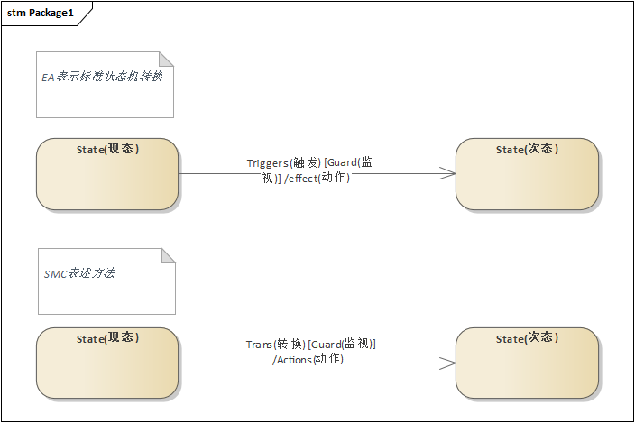

<!--  -->
# SMC
[SMC](http://smc.sourceforge.net/)是用java开发的一个状态机软件代码生成工具，SMC支持多种开发语言：C、JavaScript、Python、C++、Lua、Ruby、C#、Objective-C、Scala、Groovy、Perl、TCL、Java、PHP、VB.NET等多种开发语言,而我们需要做的就是完成一个.sm的脚本和拥有这些状态的主体类。

这里我们主要用在嵌入式当中，嵌入式已C为主，接下来给大家介绍如何使用基于 [EA15](https://sparxsystems.com/) 梳理基本状态图后，再用[SMC](http://smc.sourceforge.net/) 工具进行相应转换生成代码，在我们嵌入式平台应用

# BASE::状态机
什么是[状态机](https://baike.baidu.com/item/%E7%8A%B6%E6%80%81%E6%9C%BA/6548513?fr=aladdin)?百度或者谷歌一下会出来很多概念

这只是一个初步的印象，加强对状态机的印象，大家可以多百度下，下面只是给出一些基本概念



> 一个状态到下一个状态的转移表示为带箭头实线。转移可以有一个"Trigger"触发器，一个"Guard"监护条件和一个"effect"效果。

如上图所示 这是一个标准的状态机转换 我个人理解用伪代码表示如上过程,**action(effect) 不允在里面切状态**

```c
#define SourceState 0
#define TargetState 1

char state = SourceState;

#define Trans(x)     Triggers(X)
#define action(z)    effect(z)
while(1)
{
    if(true == Trans(x))
    {
        if(true == Guard(x))
        {
            action(z);
            state = TargetState;
        }
    }
}
```
# BASE::EA
[EA](https://sparxsystems.com/) EA跟Rational Rose一样都仅仅是一个UML建模软件，随着对EA的熟悉发现EA的功能太强大了。EA跟Rational Rose大不一样，Rational Rose只是实现对软件的建模即构建系统的UML模型，而EA却不仅仅是实现这些功能。对于一个软件设计者来说，从需求分析到概要设计、详细设计、数据库设计到测试、发布、部署等一系列软件设计必须的操作都可以在EA中完成。可以说只需要一个EA就可以完成一个软件的设计。

# EXAMPLE
本文的example 均提取为 smc_7_0_0 中例子，~~对每个例子进行EA画出相对应的状态图进行补充~~，且每个例子都有
英文README.txt说明

其中 **nil** 指示此转换为环回转换;
## EX1


# REFERENCE

[1.状态机生成工具——SMC](https://blog.csdn.net/m0_37567543/article/details/78673097)

[2.UML 状态机图](https://www.cnblogs.com/yxx123/p/5227267.html)

[3.EA&UML日拱一卒-状态图::状态机](https://blog.csdn.net/craftsman1970/article/details/78333812)

[4.UML工具：EA（Enterprise Architect）](https://blog.csdn.net/zhangchen124/article/details/88311218)